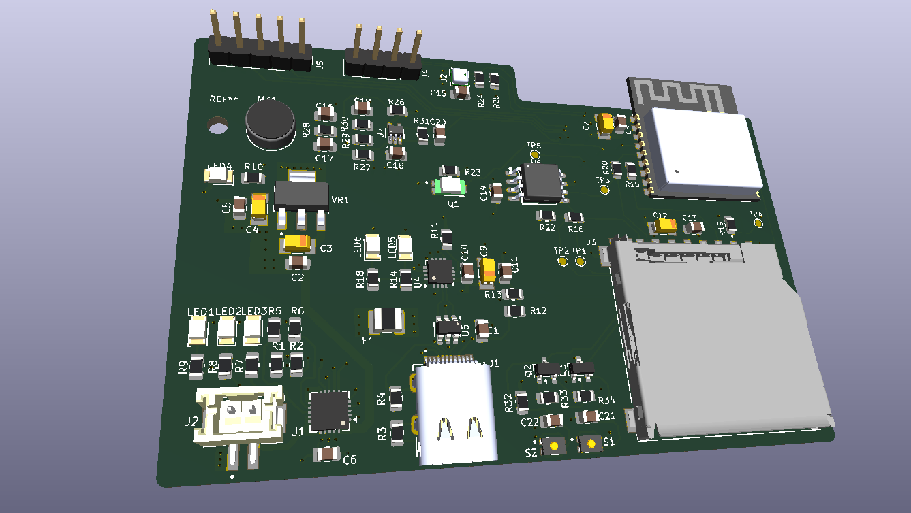

# KLP-5e ESP32-C3 Sensor Board

> **Learning Recreation Project**

This is a learning recreation of the **KLP-5e ESP32-C3 4-layer IoT sensor board**. The schematic and PCB were recreated in KiCad by following the **Tech Explorations** tutorial. The resulting design closely follows the original reference project and was created to gain hands-on experience with a professional multilayer PCB design workflow.



## Project Status

* [x] Schematic recreated
* [x] 4-layer PCB layout completed
* [x] Design Rule Check (DRC) completed
* [x] Gerber and drill files generated
* [x] DFM/Gerber review completed
* [ ] PCB manufactured
* [ ] Hardware assembled
* [ ] Hardware tested

> The PCB design is complete, but this recreation has **not yet been manufactured, assembled, or hardware tested by me**.

## Overview

This project focuses on learning professional **4-layer PCB design** using KiCad through the recreation of an ESP32-C3 based IoT development board. The design integrates wireless connectivity, battery charging, environmental sensing, storage interfaces, display connectivity, and power management into a compact multilayer PCB.

The objective of this project was to understand the complete PCB design workflow, including schematic capture, component placement, multilayer routing, design validation, and manufacturing file generation.

## Board Features

* ESP32-C3-02 microcontroller with Wi-Fi and Bluetooth Low Energy
* 4-layer PCB stackup
* USB-C connector for power and programming interface
* TP4056 single-cell Li-ion battery charging circuit
* LiPo battery connector
* BME280 temperature, humidity, and pressure sensor
* Ambient light sensing
* Sound sensing circuit
* MicroSD card interface for data storage
* External flash memory
* I²C OLED display interface
* GPIO expansion interfaces
* Status LEDs and boot/reset circuitry
* Generated Gerber and drill files for manufacturing

## Learning Objectives

During this project, I practiced and learned:

* KiCad schematic design
* Hierarchical schematic organization
* 4-layer PCB stackup design
* Component placement and footprint selection
* Power distribution and grounding
* Decoupling capacitor placement
* Signal routing across multiple copper layers
* I²C and SPI peripheral integration
* USB and power management layout considerations
* Design Rule Checking (DRC)
* Gerber generation
* Drill file generation
* Design for Manufacturing (DFM) review

## Repository Structure

```text
.
├── Images/
│   └── PCB-3DView.png
│
├── KiCad 9 Esp32 Demo Project.kicad_pro
├── KiCad 9 Esp32 Demo Project.kicad_sch
├── KiCad 9 Esp32 Demo Project.kicad_pcb
│
├── esp32-c3-02.kicad_sch
├── sensors.kicad_sch
├── user_interface.kicad_sch
│
├── dfm/
│   └── gerber/
│
└── Esp32Project/
    └── Manufacturing output files
```

## Manufacturing Files

The repository includes generated manufacturing outputs such as:

* Gerber copper layers
* Solder mask layers
* Silkscreen layers
* Paste layers
* Board outline
* PTH and NPTH drill files
* Gerber job file

These files were generated as part of the KiCad PCB design workflow and reviewed during the learning exercise.

## Tools Used

* **KiCad 10** (project originally started in KiCad 9)
* ESP32-C3 hardware platform
* PCB Layout Editor
* Schematic Editor
* Gerber Viewer
* DRC and DFM tools

## Credits

This project is a **learning recreation** based on the original **KLP-5e ESP32-C3 Sensor Board** and the accompanying KiCad tutorial by **Tech Explorations (Peter Dalmaris)**.

* Original tutorial: Tech Explorations
* Original reference repository: `futureshocked/KLP-5e-ESP32-sensor-board`

I do **not** claim the original circuit or PCB design as my own. This repository documents my recreation and learning process using KiCad. The original project includes further design improvements, manufacturing, assembly, and hardware testing that are not yet part of my recreation.

## Future Work

* Make design improvements and explore possible modifications
* Manufacture the PCB
* Assemble the components
* Perform bring-up and hardware testing
* Validate power, charging, sensors, and storage interfaces
* Document testing results and board photographs
